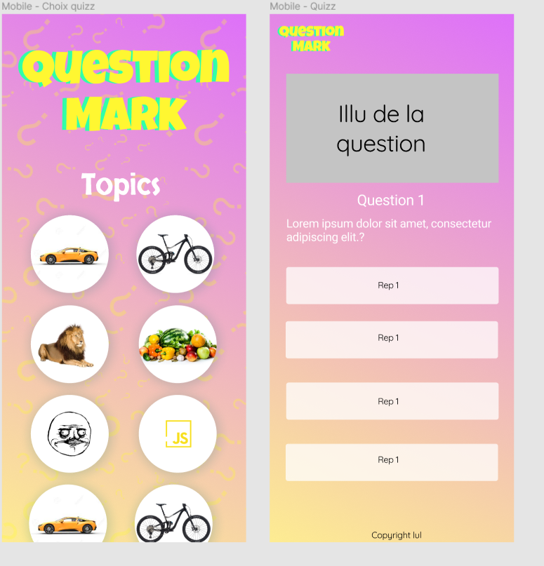

# vue-js-quizz

## Project goals

The goal of this project was to get a first approach with the VueJS framework. I also tried for the first time using Tailwind CSS. It tooks me approx. one week to realize what I've done so far. Not much but it was not that easy to use tailwind and to discover VueJs at the same time.

## Project

I had the idea to develop the frontend of a quizz game called "Question Mark". Using VueJS components, views, routes,... + Tailwind CSS. 
Here is the main idea I had for the mockups :

## Not deployed

You can see see the project by downloading the repo and using the commande npm run serve in the terminal. 

